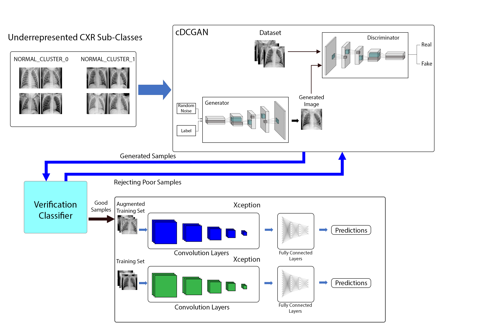

# iDeComp
iDeComp: Imbalance-Aware Decomposition for Class-Decomposed Classification using Conditional GANs
## Abstract
Medical image classification tasks often suffer from the problem of class imbalance, leading to training of biased models with poor classification performance. DeTraC, a class decomposition approach paired with transfer learning is a proven approach for classifying medical imaging datasets suffering from class imbalance. An extension of DeTraC, iDeComp, is proposed in order to further increase the performance gains obtained from the use of DeTraC, iDeComp implements the use of a conditional GAN model to generate additional samples for underrepresented classes. In this paper, two medical imaging datasets are used, the underrepresented samples from the training set of each dataset we’re used to train two separate conditional DCGAN models and verification models. The conditional DCGAN model generates additional samples and the verification model verifies the appropriateness of the synthesised images. The additional samples we’re then used to train 2 separate DeTraC classification models for each dataset, one using the augmented training set and one using the non-augmented training set. The models for each dataset we’re evaluated using evaluation metrics such as Accuracy, Precision, Recall and F1-Score. The results demonstrate that iDeComp was able to outperform DeTraC in classifying both imbalanced datasets.
# Model Architecture
  
